# Maryland Enrollment Trends

``` r
library(mdschooldata)
library(ggplot2)
library(dplyr)
library(scales)
```

``` r
theme_readme <- function() {
  theme_minimal(base_size = 14) +
    theme(
      plot.title = element_text(face = "bold", size = 16),
      plot.subtitle = element_text(color = "gray40"),
      panel.grid.minor = element_blank(),
      legend.position = "bottom"
    )
}

colors <- c("total" = "#2C3E50", "highlight" = "#E67E22", "secondary" = "#95A5A6",
            "decline" = "#E74C3C", "growth" = "#27AE60", "blue" = "#3498DB")
```

``` r
enr <- fetch_enr_multi(2016:2024, use_cache = TRUE)
enr_current <- fetch_enr(2024, use_cache = TRUE)

# Helper function to get unique district totals
get_district_totals <- function(df) {
  df %>%
    filter(is_district, grade_level == "TOTAL", subgroup == "total_enrollment") %>%
    select(end_year, district_name, n_students) %>%
    distinct()
}

# Helper function to get unique state totals
get_state_totals <- function(df) {
  df %>%
    filter(is_state, grade_level == "TOTAL", subgroup == "total_enrollment") %>%
    select(end_year, n_students) %>%
    distinct()
}
```

## 1. Montgomery County is Maryland’s largest district with 155,000 students

Montgomery County Public Schools enrolls more students than entire
states like Wyoming or Vermont. It is one of the top 20 largest school
districts in the nation.

``` r
top_districts <- get_district_totals(enr_current) %>%
  arrange(desc(n_students)) %>%
  head(5) %>%
  mutate(district_label = reorder(district_name, n_students))

stopifnot(nrow(top_districts) > 0)

top_districts %>%
  select(district_name, n_students)
#>          district_name n_students
#> 1...1       Montgomery     154791
#> 1...2  Prince George's     127330
#> 1...3 Baltimore County     105944
#> 1...4     Anne Arundel      82353
#> 1...5   Baltimore City      72995

ggplot(top_districts, aes(x = district_label, y = n_students)) +
  geom_col(fill = colors["total"]) +
  coord_flip() +
  scale_y_continuous(labels = comma) +
  labs(title = "Maryland's Largest School Systems, 2024",
       subtitle = "Montgomery County leads with 155,000 students",
       x = "", y = "Students") +
  theme_readme()
```

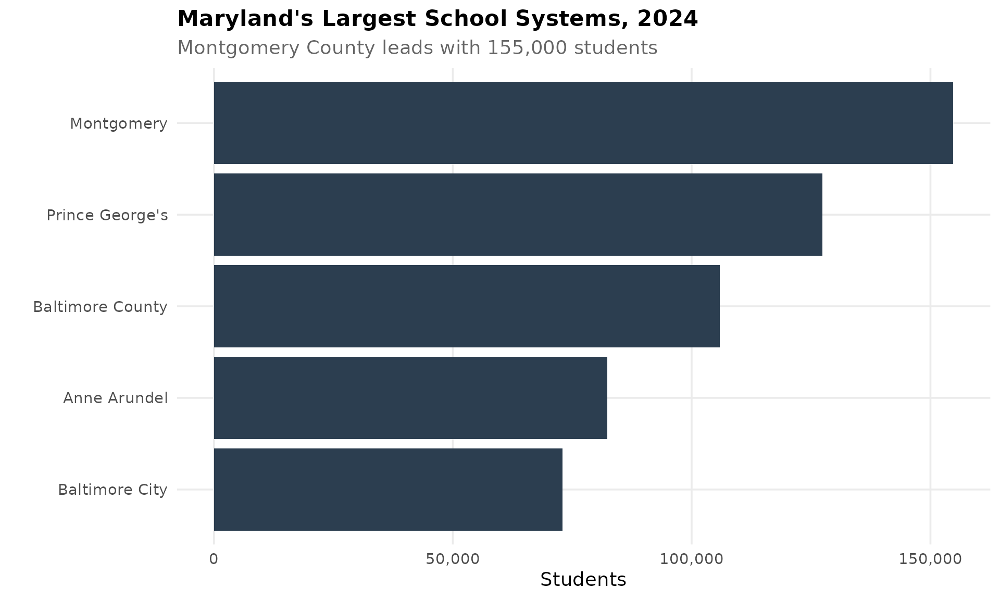

## 2. Maryland enrollment has been remarkably stable since 2016

Maryland has maintained roughly 855,000-877,000 students over the past 9
years. A brief dip during COVID in 2020-2021 recovered by 2022, and
enrollment has held steady near 859,000.

``` r
state_trend <- get_state_totals(enr) %>%
  arrange(end_year)

stopifnot(nrow(state_trend) > 0)

state_trend %>%
  select(end_year, n_students)
#>       end_year n_students
#> 1...1     2016     854913
#> 1...2     2017     862867
#> 1...3     2018     865491
#> 1...4     2019     876810
#> 1...5     2020     858519
#> 1...6     2021     853307
#> 1...7     2022     858850
#> 1...8     2023     858362
#> 1...9     2024     859083

ggplot(state_trend, aes(x = end_year, y = n_students)) +
  geom_line(linewidth = 1.5, color = colors["total"]) +
  geom_point(size = 3, color = colors["total"]) +
  geom_vline(xintercept = 2020, linetype = "dashed", color = "red", alpha = 0.5) +
  annotate("text", x = 2020, y = max(state_trend$n_students) + 2000,
           label = "COVID", color = "red", size = 3) +
  scale_y_continuous(labels = comma) +
  labs(title = "Maryland Statewide Enrollment, 2016-2024",
       subtitle = "Remarkably stable at ~859,000 students",
       x = "School Year", y = "Students") +
  theme_readme()
```

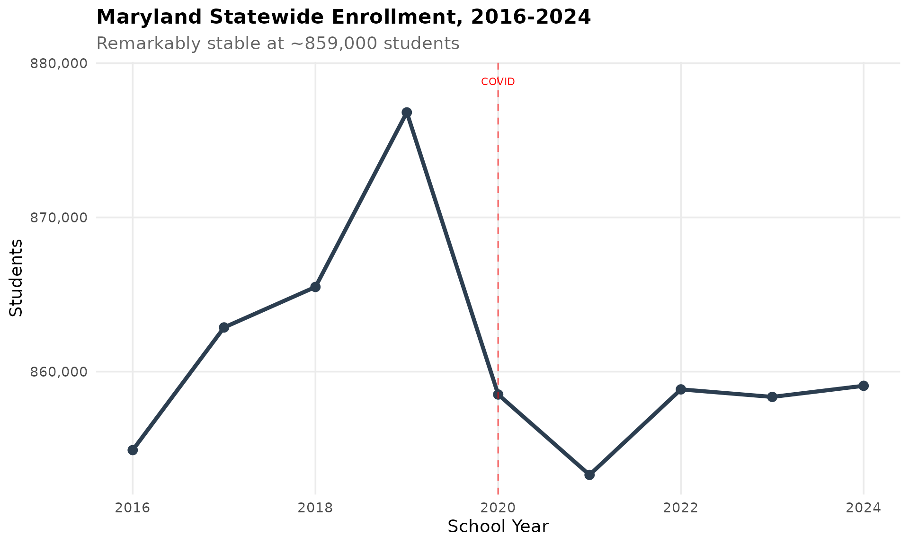

## 3. Baltimore City lost nearly 5,000 students since 2016

Baltimore City enrollment has declined 6.3% from 77,866 in 2016 to
72,995 in 2024. The decline has been steady, with a slight uptick in
2024. Population loss and suburban migration are driving forces.

``` r
baltimore <- get_district_totals(enr) %>%
  filter(district_name == "Baltimore City") %>%
  arrange(end_year)

stopifnot(nrow(baltimore) > 0)

baltimore %>%
  filter(end_year %in% c(min(end_year), max(end_year))) %>%
  mutate(change = n_students - lag(n_students),
         pct_change = round((n_students / lag(n_students) - 1) * 100, 1))
#>       end_year  district_name n_students change pct_change
#> 1...1     2016 Baltimore City      77866     NA         NA
#> 1...2     2024 Baltimore City      72995  -4871       -6.3

ggplot(baltimore, aes(x = end_year, y = n_students)) +
  geom_line(linewidth = 1.5, color = colors["decline"]) +
  geom_point(size = 3, color = colors["decline"]) +
  scale_y_continuous(labels = comma, limits = c(0, NA)) +
  labs(title = "Baltimore City Enrollment Decline",
       subtitle = "Lost nearly 5,000 students (-6.3%) from 2016 to 2024",
       x = "School Year", y = "Students") +
  theme_readme()
```

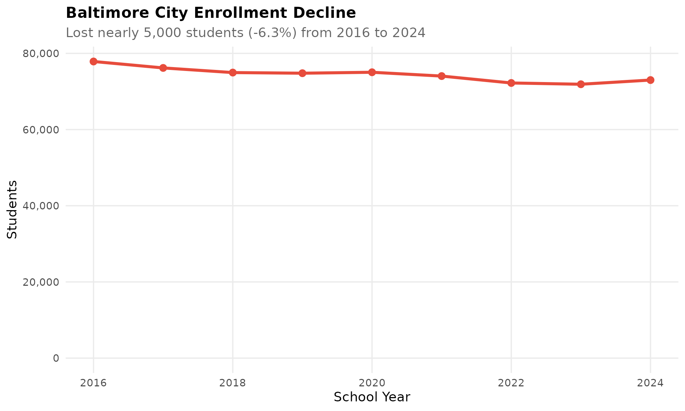

## 4. Kindergarten dropped 10% in 2020 and never fully recovered

COVID hit kindergarten hardest. Maryland lost 10.3% of kindergartners in
the 2019-20 school year as families delayed enrollment. By 2024,
kindergarten enrollment is still 8.5% below its 2019 peak, suggesting
some students shifted permanently out of public schools.

``` r
k_trend <- enr %>%
  filter(is_state, subgroup == "total_enrollment",
         grade_level %in% c("K", "01", "06", "12")) %>%
  select(end_year, grade_level, n_students) %>%
  distinct() %>%
  mutate(grade_label = case_when(
    grade_level == "K" ~ "Kindergarten",
    grade_level == "01" ~ "Grade 1",
    grade_level == "06" ~ "Grade 6",
    grade_level == "12" ~ "Grade 12"
  ))

stopifnot(nrow(k_trend) > 0)

k_trend %>%
  filter(grade_level == "K") %>%
  select(end_year, n_students) %>%
  mutate(change = n_students - lag(n_students),
         pct_change = round((n_students / lag(n_students) - 1) * 100, 1))
#>       end_year n_students change pct_change
#> 1...1     2016      64472     NA         NA
#> 1...2     2017      64045   -427       -0.7
#> 1...3     2018      63779   -266       -0.4
#> 1...4     2019      65087   1308        2.1
#> 1...5     2020      58391  -6696      -10.3
#> 1...6     2021      61671   3280        5.6
#> 1...7     2022      60986   -685       -1.1
#> 1...8     2023      60514   -472       -0.8
#> 1...9     2024      59562   -952       -1.6

ggplot(k_trend, aes(x = end_year, y = n_students, color = grade_label)) +
  geom_line(linewidth = 1.2) +
  geom_point(size = 2.5) +
  geom_vline(xintercept = 2020, linetype = "dashed", color = "red", alpha = 0.5) +
  annotate("text", x = 2020, y = max(k_trend$n_students, na.rm = TRUE) + 1000,
           label = "COVID", color = "red", size = 3) +
  scale_y_continuous(labels = comma) +
  labs(title = "COVID Impact on Grade-Level Enrollment",
       subtitle = "Kindergarten dropped 10.3% in 2020 and has not recovered",
       x = "School Year", y = "Students", color = "") +
  theme_readme()
```

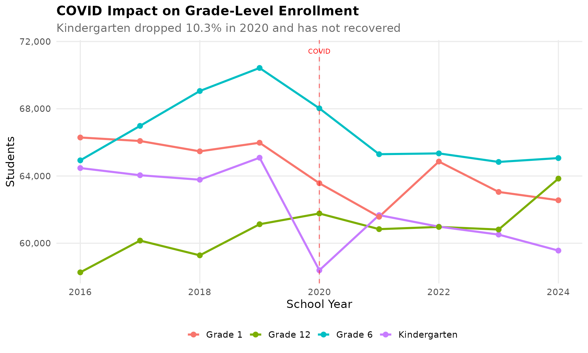

## 5. The Eastern Shore has barely changed in a decade

Five Eastern Shore counties (Worcester, Somerset, Dorchester, Wicomico,
and Caroline) collectively serve about 33,000 students. Unlike the
dramatic declines seen elsewhere, the Eastern Shore has been remarkably
stable since 2016.

``` r
eastern_shore <- c("Worcester", "Somerset", "Dorchester", "Wicomico", "Caroline")

eastern <- get_district_totals(enr) %>%
  filter(district_name %in% eastern_shore) %>%
  group_by(end_year) %>%
  summarize(n_students = sum(n_students, na.rm = TRUE), .groups = "drop") %>%
  arrange(end_year)

stopifnot(nrow(eastern) > 0)

eastern %>%
  filter(end_year %in% c(min(end_year), max(end_year))) %>%
  mutate(change = n_students - lag(n_students),
         pct_change = round((n_students / lag(n_students) - 1) * 100, 1))
#> # A tibble: 2 × 4
#>   end_year n_students change pct_change
#>      <int>      <dbl>  <dbl>      <dbl>
#> 1     2016      33326     NA       NA  
#> 2     2024      33491    165        0.5

ggplot(eastern, aes(x = end_year, y = n_students)) +
  geom_line(linewidth = 1.5, color = colors["total"]) +
  geom_point(size = 3, color = colors["total"]) +
  scale_y_continuous(labels = comma) +
  labs(title = "Eastern Shore Combined Enrollment",
       subtitle = "Five rural counties hold steady at ~33,000 students",
       x = "School Year", y = "Students") +
  theme_readme()
```

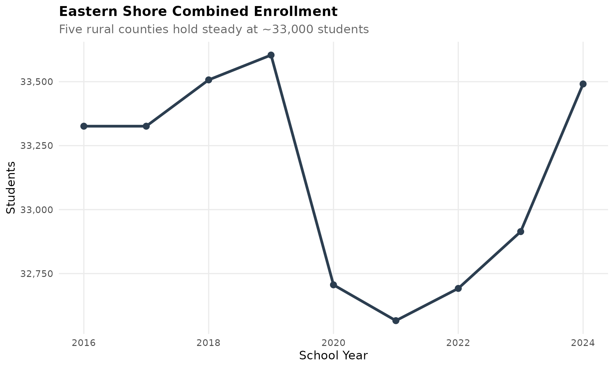

## 6. Western Maryland is shrinking: Garrett lost 12% since 2016

Allegany and Garrett counties in Appalachian Maryland have lost 7% and
12% of students respectively since 2016. These rural mountain
communities face similar population challenges to Appalachian
communities nationwide.

``` r
western <- c("Allegany", "Garrett")

western_trend <- get_district_totals(enr) %>%
  filter(district_name %in% western) %>%
  arrange(district_name, end_year)

stopifnot(nrow(western_trend) > 0)

western_trend %>%
  group_by(district_name) %>%
  filter(end_year %in% c(min(end_year), max(end_year))) %>%
  mutate(change = n_students - lag(n_students),
         pct_change = round((n_students / lag(n_students) - 1) * 100, 1)) %>%
  filter(!is.na(change)) %>%
  select(district_name, end_year, n_students, change, pct_change)
#> # A tibble: 2 × 5
#> # Groups:   district_name [2]
#>   district_name end_year n_students change pct_change
#>   <chr>            <int>      <dbl>  <dbl>      <dbl>
#> 1 Allegany          2024       7640   -572       -7  
#> 2 Garrett           2024       3193   -445      -12.2

ggplot(western_trend, aes(x = end_year, y = n_students, color = district_name)) +
  geom_line(linewidth = 1.2) +
  geom_point(size = 2.5) +
  scale_y_continuous(labels = comma) +
  labs(title = "Western Maryland Enrollment Decline",
       subtitle = "Garrett lost 12.2%, Allegany lost 7.0% since 2016",
       x = "School Year", y = "Students", color = "") +
  theme_readme()
```

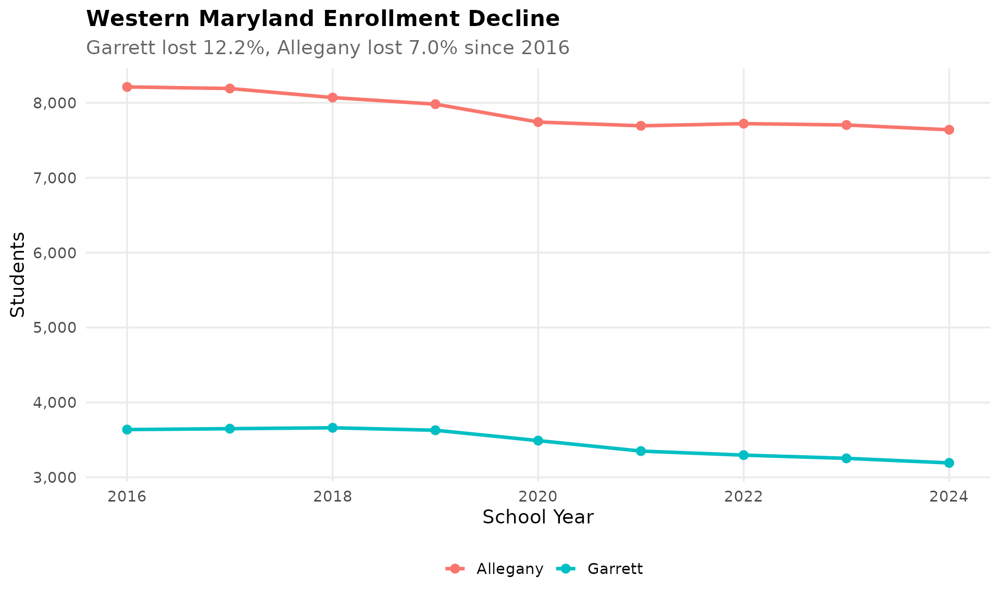

## 7. Anne Arundel grew 4% while nearby Baltimore County shrank

Anne Arundel County has quietly added 3,200 students since 2016, growing
4.1%. Meanwhile, neighboring Baltimore County lost over 2,300 students.
The Annapolis-area county benefits from military families at Fort Meade
and its proximity to both DC and Baltimore.

``` r
aa <- get_district_totals(enr) %>%
  filter(district_name == "Anne Arundel") %>%
  arrange(end_year)

stopifnot(nrow(aa) > 0)

aa %>%
  filter(end_year %in% c(min(end_year), max(end_year))) %>%
  mutate(change = n_students - lag(n_students),
         pct_change = round((n_students / lag(n_students) - 1) * 100, 1))
#>       end_year district_name n_students change pct_change
#> 1...1     2016  Anne Arundel      79126     NA         NA
#> 1...2     2024  Anne Arundel      82353   3227        4.1

ggplot(aa, aes(x = end_year, y = n_students)) +
  geom_line(linewidth = 1.5, color = colors["growth"]) +
  geom_point(size = 3, color = colors["growth"]) +
  scale_y_continuous(labels = comma, limits = c(0, NA)) +
  labs(title = "Anne Arundel County Enrollment Growth",
       subtitle = "Added 3,200 students (+4.1%) since 2016",
       x = "School Year", y = "Students") +
  theme_readme()
```

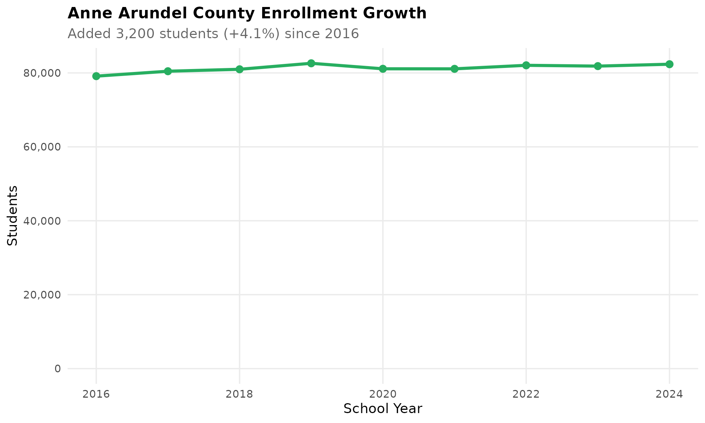

## 8. The I-95 corridor enrolls 61% of all Maryland students

Five counties along I-95 (Baltimore County, Montgomery, Prince George’s,
Howard, and Anne Arundel) enroll 526,000 of Maryland’s 859,000 students.
This 61% concentration reflects the state’s suburban population center
between DC and Baltimore.

``` r
i95 <- c("Baltimore County", "Montgomery", "Prince George's", "Howard", "Anne Arundel")

corridor <- get_district_totals(enr_current) %>%
  mutate(corridor = ifelse(district_name %in% i95, "I-95 Corridor", "Rest of Maryland")) %>%
  group_by(corridor) %>%
  summarize(n_students = sum(n_students, na.rm = TRUE), .groups = "drop")

stopifnot(nrow(corridor) == 2)

corridor %>%
  mutate(pct = round(n_students / sum(n_students) * 100, 1))
#> # A tibble: 2 × 3
#>   corridor         n_students   pct
#>   <chr>                 <dbl> <dbl>
#> 1 I-95 Corridor        526451  61.3
#> 2 Rest of Maryland     332632  38.7

ggplot(corridor, aes(x = corridor, y = n_students, fill = corridor)) +
  geom_col() +
  scale_y_continuous(labels = comma) +
  scale_fill_manual(values = c("I-95 Corridor" = "#2C3E50", "Rest of Maryland" = "#95A5A6")) +
  labs(title = "The I-95 Corridor Dominates Maryland Education",
       subtitle = "Five counties along I-95 enroll 61% of all students",
       x = "", y = "Students") +
  theme_readme() +
  theme(legend.position = "none")
```

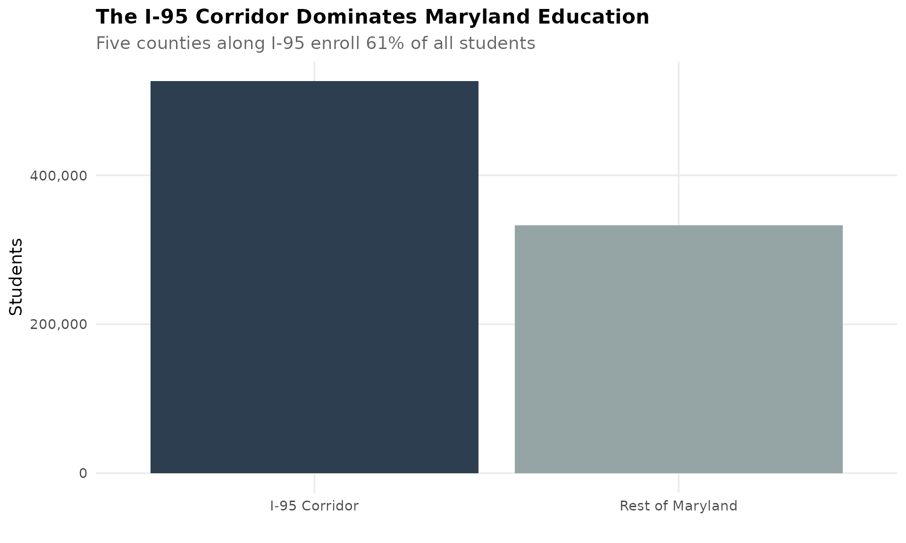

## 9. Frederick County grew 16% – fastest in the state

Frederick County has added over 6,300 students since 2016, a 15.8%
increase. Located between the DC suburbs and western Maryland, Frederick
attracts families seeking more affordable housing while maintaining
access to the DC job market.

``` r
frederick <- get_district_totals(enr) %>%
  filter(district_name == "Frederick") %>%
  arrange(end_year)

stopifnot(nrow(frederick) > 0)

frederick %>%
  filter(end_year %in% c(min(end_year), max(end_year))) %>%
  mutate(change = n_students - lag(n_students),
         pct_change = round((n_students / lag(n_students) - 1) * 100, 1))
#>       end_year district_name n_students change pct_change
#> 1...1     2016     Frederick      40111     NA         NA
#> 1...2     2024     Frederick      46468   6357       15.8

ggplot(frederick, aes(x = end_year, y = n_students)) +
  geom_line(linewidth = 1.5, color = colors["growth"]) +
  geom_point(size = 3, color = colors["growth"]) +
  scale_y_continuous(labels = comma, limits = c(0, NA)) +
  labs(title = "Frederick County Enrollment Growth",
       subtitle = "DC exurbs driving 15.8% growth since 2016",
       x = "School Year", y = "Students") +
  theme_readme()
```

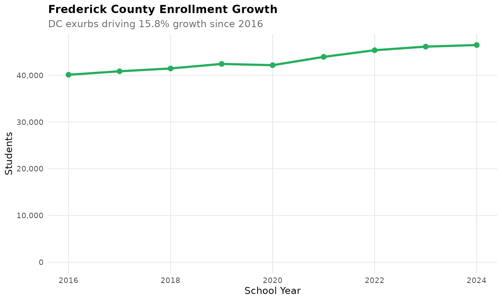

## 10. Baltimore County vs Baltimore City: Divergent paths

While Baltimore City lost nearly 5,000 students (-6.3%), Baltimore
County also shrank but from a higher base. The county surrounds but is
entirely separate from the city. Both are losing students, though at
different rates.

``` r
baltimore_both <- get_district_totals(enr) %>%
  filter(district_name %in% c("Baltimore City", "Baltimore County")) %>%
  arrange(district_name, end_year)

stopifnot(nrow(baltimore_both) > 0)

baltimore_both %>%
  group_by(district_name) %>%
  filter(end_year %in% c(min(end_year), max(end_year))) %>%
  mutate(change = n_students - lag(n_students),
         pct_change = round((n_students / lag(n_students) - 1) * 100, 1)) %>%
  filter(!is.na(change)) %>%
  select(district_name, end_year, n_students, change, pct_change)
#> # A tibble: 2 × 5
#> # Groups:   district_name [2]
#>   district_name    end_year n_students change pct_change
#>   <chr>               <int>      <dbl>  <dbl>      <dbl>
#> 1 Baltimore City       2024      72995  -4871       -6.3
#> 2 Baltimore County     2024     105944  -2372       -2.2

ggplot(baltimore_both, aes(x = end_year, y = n_students, color = district_name)) +
  geom_line(linewidth = 1.2) +
  geom_point(size = 2.5) +
  scale_y_continuous(labels = comma) +
  scale_color_manual(values = c("Baltimore City" = "#E74C3C", "Baltimore County" = "#3498DB")) +
  labs(title = "Baltimore City vs Baltimore County",
       subtitle = "Both declining, from different starting points",
       x = "School Year", y = "Students", color = "") +
  theme_readme()
```

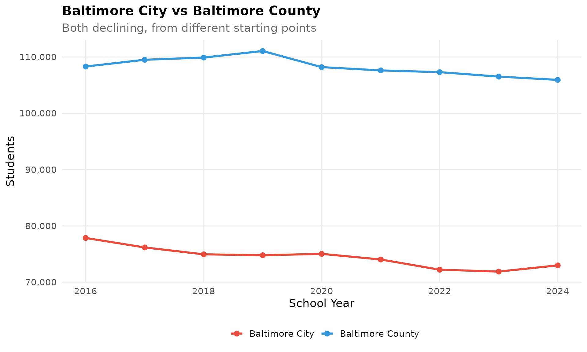

## 11. Howard County plateaued after years of growth

Howard County grew from 54,348 in 2016 to 57,508 in 2019, then
flattened. The county is now one of the few large districts in Maryland
where enrollment has stopped growing, possibly reflecting the limits of
available housing.

``` r
howard <- get_district_totals(enr) %>%
  filter(district_name == "Howard") %>%
  arrange(end_year)

stopifnot(nrow(howard) > 0)

howard %>%
  filter(end_year %in% c(min(end_year), max(end_year))) %>%
  mutate(change = n_students - lag(n_students),
         pct_change = round((n_students / lag(n_students) - 1) * 100, 1))
#>       end_year district_name n_students change pct_change
#> 1...1     2016        Howard      54348     NA         NA
#> 1...2     2024        Howard      56033   1685        3.1

ggplot(howard, aes(x = end_year, y = n_students)) +
  geom_line(linewidth = 1.5, color = colors["blue"]) +
  geom_point(size = 3, color = colors["blue"]) +
  scale_y_continuous(labels = comma, limits = c(0, NA)) +
  labs(title = "Howard County Enrollment Plateau",
       subtitle = "Growth stalled after 2019 at ~56,000 students",
       x = "School Year", y = "Students") +
  theme_readme()
```

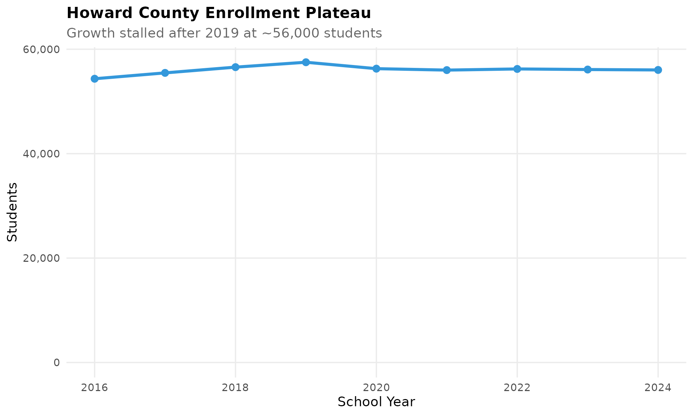

## 12. Charles County: Southern Maryland’s steady growth

Charles County is the largest district in Southern Maryland and has
added 1,483 students (+5.8%) since 2016. The county serves as a bedroom
community for DC-area workers seeking affordable housing south of the
capital.

``` r
charles <- get_district_totals(enr) %>%
  filter(district_name == "Charles") %>%
  arrange(end_year)

stopifnot(nrow(charles) > 0)

charles %>%
  filter(end_year %in% c(min(end_year), max(end_year))) %>%
  mutate(change = n_students - lag(n_students),
         pct_change = round((n_students / lag(n_students) - 1) * 100, 1))
#>       end_year district_name n_students change pct_change
#> 1...1     2016       Charles      25522     NA         NA
#> 1...2     2024       Charles      27005   1483        5.8

ggplot(charles, aes(x = end_year, y = n_students)) +
  geom_line(linewidth = 1.5, color = colors["total"]) +
  geom_point(size = 3, color = colors["total"]) +
  scale_y_continuous(labels = comma, limits = c(0, NA)) +
  labs(title = "Charles County Enrollment",
       subtitle = "Southern Maryland's largest system: steady +5.8% growth",
       x = "School Year", y = "Students") +
  theme_readme()
```

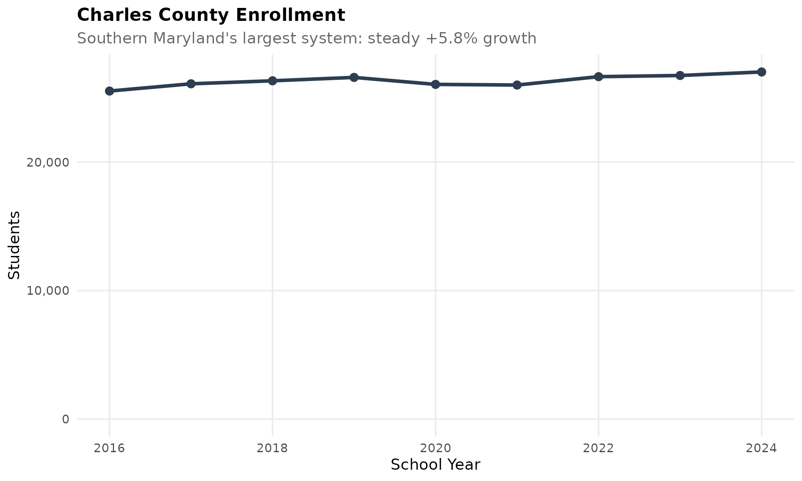

## 13. Grade 9 is 21% larger than grade 12

Maryland has 77,465 ninth-graders but only 63,844 twelfth-graders – a
21% drop. This pattern reflects both students leaving the system before
graduation and the state’s grade promotion policies.

``` r
grade_data <- enr_current %>%
  filter(is_state, subgroup == "total_enrollment", grade_level != "TOTAL") %>%
  select(grade_level, n_students) %>%
  mutate(grade_num = case_when(
    grade_level == "K" ~ 0,
    TRUE ~ as.numeric(grade_level)
  )) %>%
  arrange(grade_num)

stopifnot(nrow(grade_data) > 0)

grade_data %>%
  select(grade_level, n_students) %>%
  arrange(desc(n_students))
#>        grade_level n_students
#> 1...1           09      77465
#> 1...2           10      71084
#> 1...3           03      66787
#> 1...4           08      66456
#> 1...5           05      66109
#> 1...6           11      65596
#> 1...7           07      65407
#> 1...8           06      65065
#> 1...9           04      65025
#> 1...10          02      64126
#> 1...11          12      63844
#> 1...12          01      62557
#> 1...13           K      59562

ggplot(grade_data, aes(x = factor(grade_level, levels = c("K", sprintf("%02d", 1:12))),
                       y = n_students)) +
  geom_col(fill = colors["total"]) +
  scale_y_continuous(labels = comma) +
  labs(title = "Maryland Enrollment by Grade Level, 2024",
       subtitle = "Grade 9 (77K) is 30% larger than Kindergarten (60K)",
       x = "Grade", y = "Students") +
  theme_readme()
```

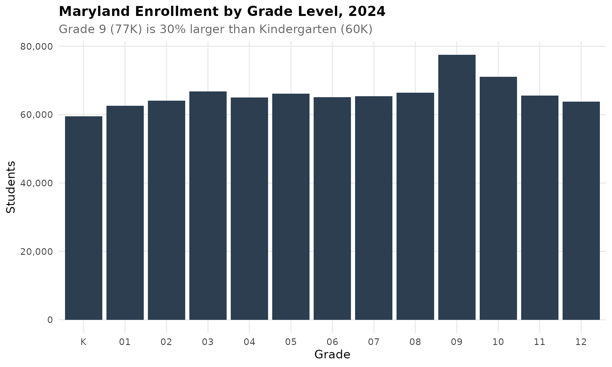

## 14. Montgomery County peaked in 2019 and has been declining

Maryland’s largest district reached 160,587 students in 2019, then lost
nearly 6,000 students by 2024. This 3.6% decline in the state’s flagship
district signals broader suburban enrollment pressure.

``` r
montgomery <- get_district_totals(enr) %>%
  filter(district_name == "Montgomery") %>%
  arrange(end_year)

stopifnot(nrow(montgomery) > 0)

montgomery %>%
  select(end_year, n_students) %>%
  mutate(change = n_students - lag(n_students),
         pct_change = round((n_students / lag(n_students) - 1) * 100, 1))
#>       end_year n_students change pct_change
#> 1...1     2016     154690     NA         NA
#> 1...2     2017     157123   2433        1.6
#> 1...3     2018     158101    978        0.6
#> 1...4     2019     160587   2486        1.6
#> 1...5     2020     156967  -3620       -2.3
#> 1...6     2021     154592  -2375       -1.5
#> 1...7     2022     156246   1654        1.1
#> 1...8     2023     155788   -458       -0.3
#> 1...9     2024     154791   -997       -0.6

ggplot(montgomery, aes(x = end_year, y = n_students)) +
  geom_line(linewidth = 1.5, color = colors["decline"]) +
  geom_point(size = 3, color = colors["decline"]) +
  scale_y_continuous(labels = comma, limits = c(0, NA)) +
  labs(title = "Montgomery County: From Growth to Decline",
       subtitle = "Lost nearly 6,000 students since 2019 peak",
       x = "School Year", y = "Students") +
  theme_readme()
```

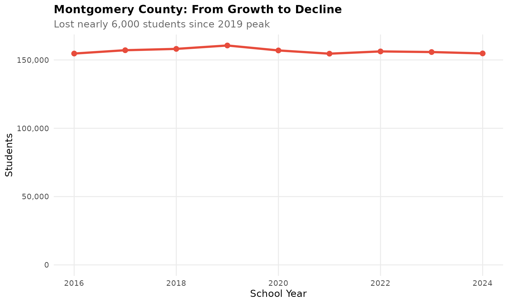

## 15. Small counties face existential challenges

Kent County has just 1,591 students, Somerset has 2,619, and Garrett has
3,193. These are among the smallest school districts in the mid-Atlantic
region, making it difficult to offer diverse programs and maintain
facilities.

``` r
small_counties <- c("Kent", "Somerset", "Garrett")

small_trend <- get_district_totals(enr) %>%
  filter(district_name %in% small_counties) %>%
  arrange(district_name, end_year)

stopifnot(nrow(small_trend) > 0)

small_trend %>%
  filter(end_year == max(end_year)) %>%
  select(district_name, n_students) %>%
  arrange(n_students)
#>       district_name n_students
#> 1...1          Kent       1591
#> 1...2      Somerset       2619
#> 1...3       Garrett       3193

ggplot(small_trend, aes(x = end_year, y = n_students, color = district_name)) +
  geom_line(linewidth = 1.2) +
  geom_point(size = 2.5) +
  scale_y_continuous(labels = comma) +
  labs(title = "Maryland's Smallest School Systems",
       subtitle = "Kent, Somerset, and Garrett face enrollment pressure",
       x = "School Year", y = "Students", color = "") +
  theme_readme()
```

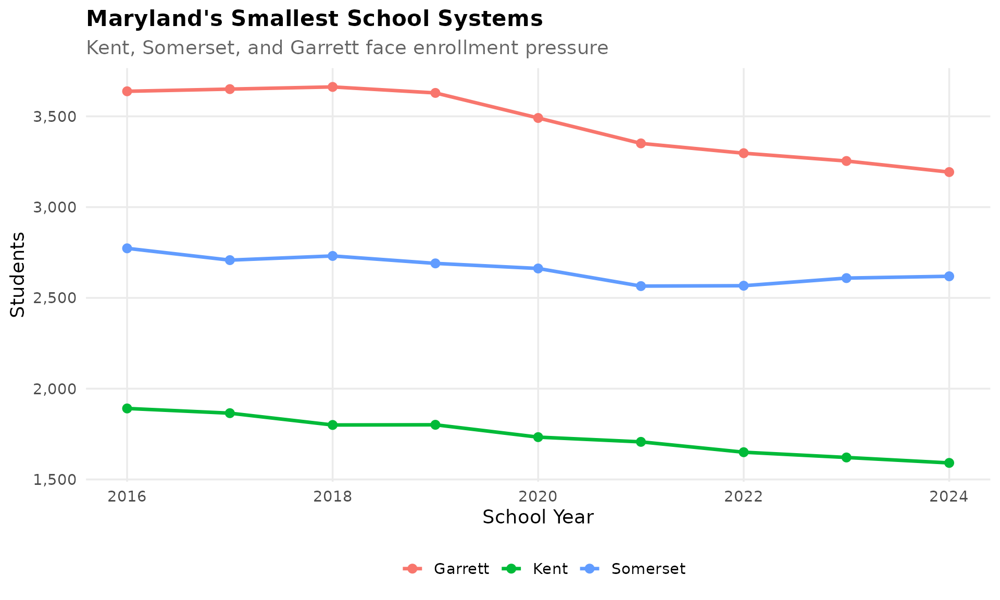

``` r
sessionInfo()
#> R version 4.5.2 (2025-10-31)
#> Platform: x86_64-pc-linux-gnu
#> Running under: Ubuntu 24.04.3 LTS
#> 
#> Matrix products: default
#> BLAS:   /usr/lib/x86_64-linux-gnu/openblas-pthread/libblas.so.3 
#> LAPACK: /usr/lib/x86_64-linux-gnu/openblas-pthread/libopenblasp-r0.3.26.so;  LAPACK version 3.12.0
#> 
#> locale:
#>  [1] LC_CTYPE=C.UTF-8       LC_NUMERIC=C           LC_TIME=C.UTF-8       
#>  [4] LC_COLLATE=C.UTF-8     LC_MONETARY=C.UTF-8    LC_MESSAGES=C.UTF-8   
#>  [7] LC_PAPER=C.UTF-8       LC_NAME=C              LC_ADDRESS=C          
#> [10] LC_TELEPHONE=C         LC_MEASUREMENT=C.UTF-8 LC_IDENTIFICATION=C   
#> 
#> time zone: UTC
#> tzcode source: system (glibc)
#> 
#> attached base packages:
#> [1] stats     graphics  grDevices utils     datasets  methods   base     
#> 
#> other attached packages:
#> [1] scales_1.4.0       dplyr_1.2.0        ggplot2_4.0.2      mdschooldata_0.3.0
#> 
#> loaded via a namespace (and not attached):
#>  [1] gtable_0.3.6       jsonlite_2.0.0     compiler_4.5.2     tidyselect_1.2.1  
#>  [5] jquerylib_0.1.4    systemfonts_1.3.2  textshaping_1.0.5  readxl_1.4.5      
#>  [9] yaml_2.3.12        fastmap_1.2.0      R6_2.6.1           labeling_0.4.3    
#> [13] generics_0.1.4     curl_7.0.0         knitr_1.51         tibble_3.3.1      
#> [17] desc_1.4.3         bslib_0.10.0       pillar_1.11.1      RColorBrewer_1.1-3
#> [21] rlang_1.1.7        utf8_1.2.6         cachem_1.1.0       xfun_0.56         
#> [25] fs_1.6.7           sass_0.4.10        S7_0.2.1           cli_3.6.5         
#> [29] pkgdown_2.2.0      withr_3.0.2        magrittr_2.0.4     digest_0.6.39     
#> [33] grid_4.5.2         rappdirs_0.3.4     lifecycle_1.0.5    vctrs_0.7.1       
#> [37] evaluate_1.0.5     glue_1.8.0         cellranger_1.1.0   farver_2.1.2      
#> [41] codetools_0.2-20   ragg_1.5.1         httr_1.4.8         rmarkdown_2.30    
#> [45] purrr_1.2.1        tools_4.5.2        pkgconfig_2.0.3    htmltools_0.5.9
```
