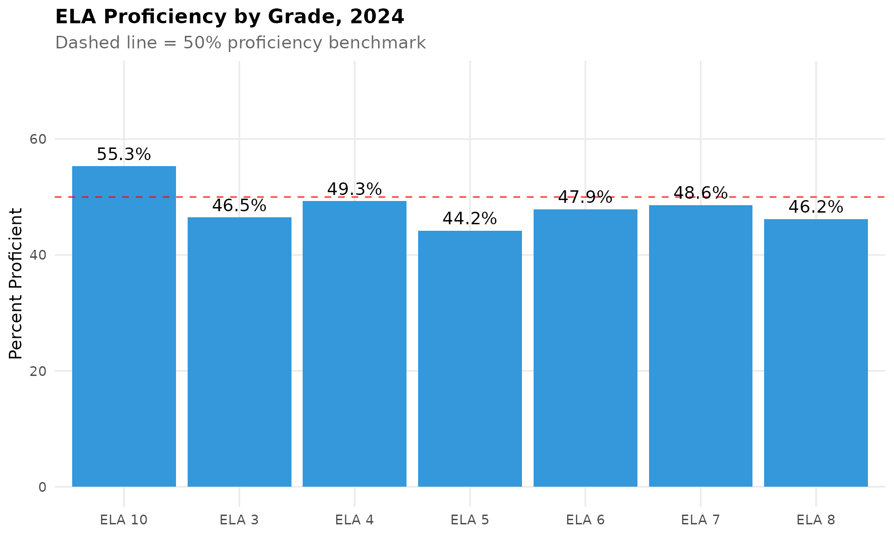
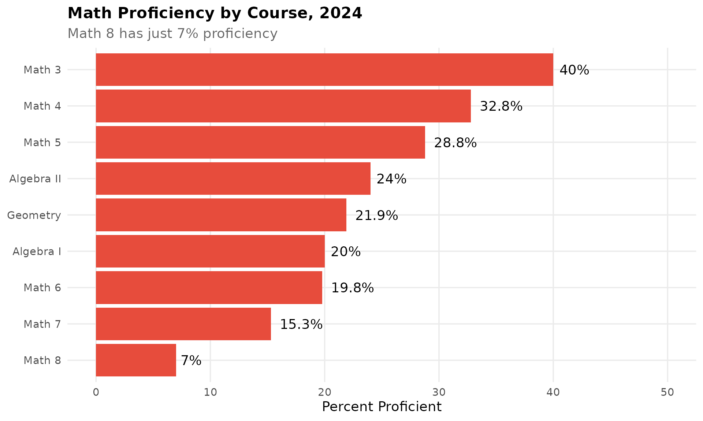
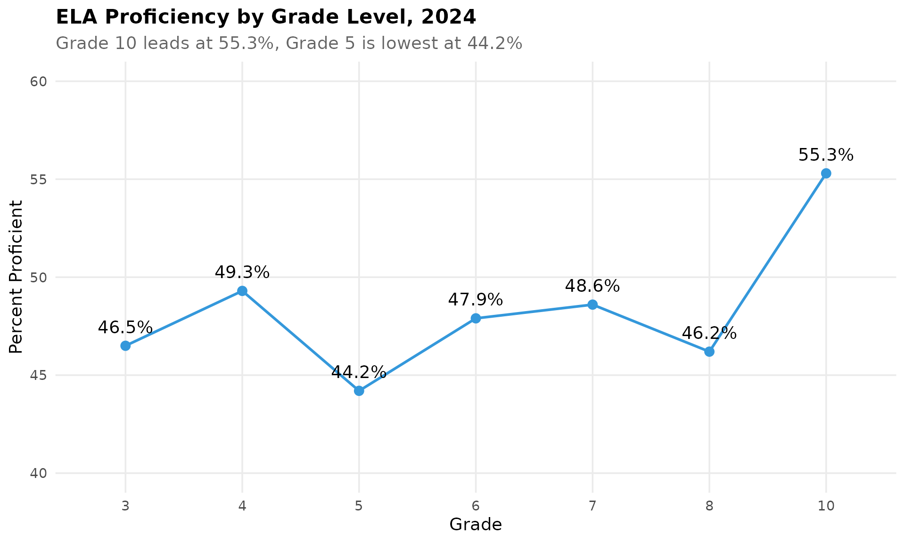
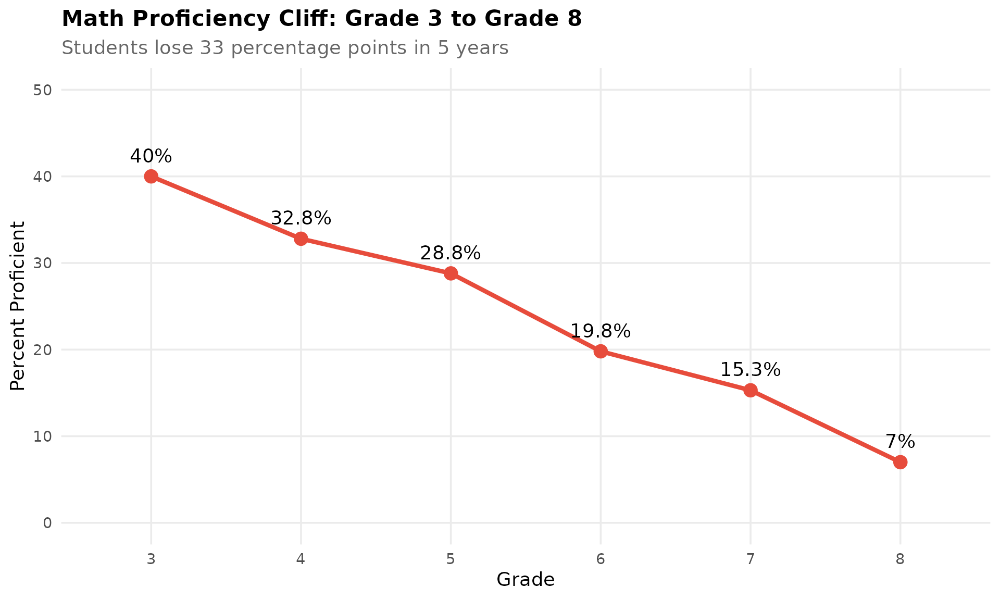
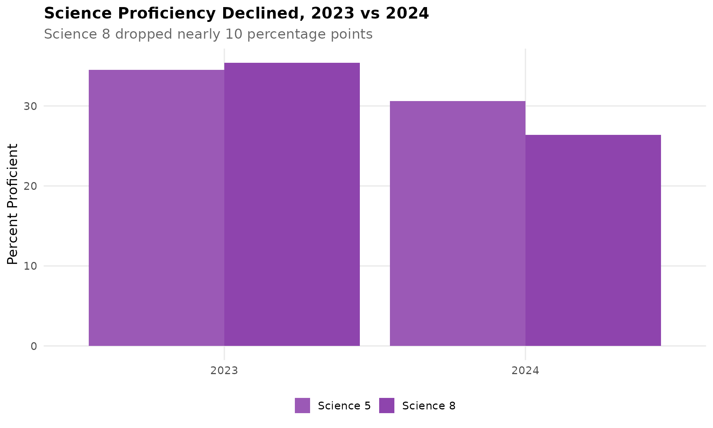
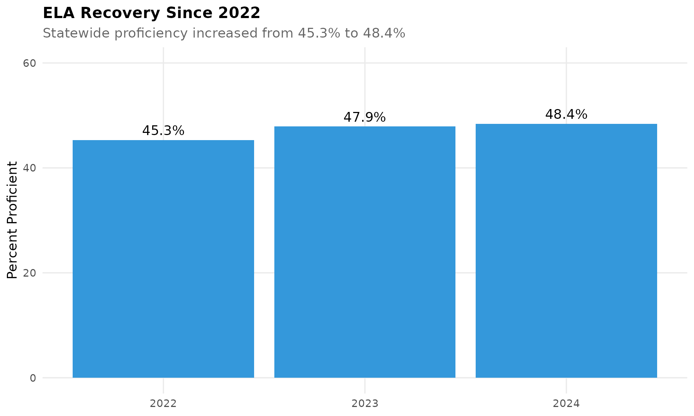
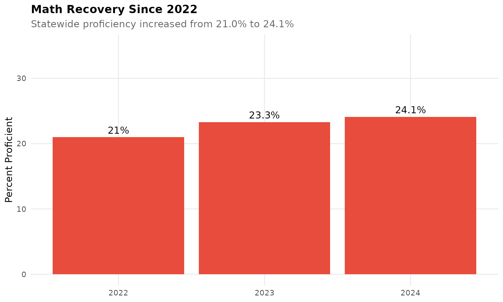
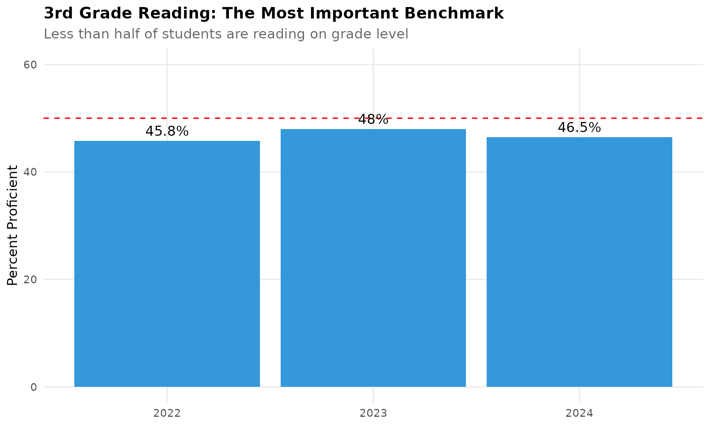
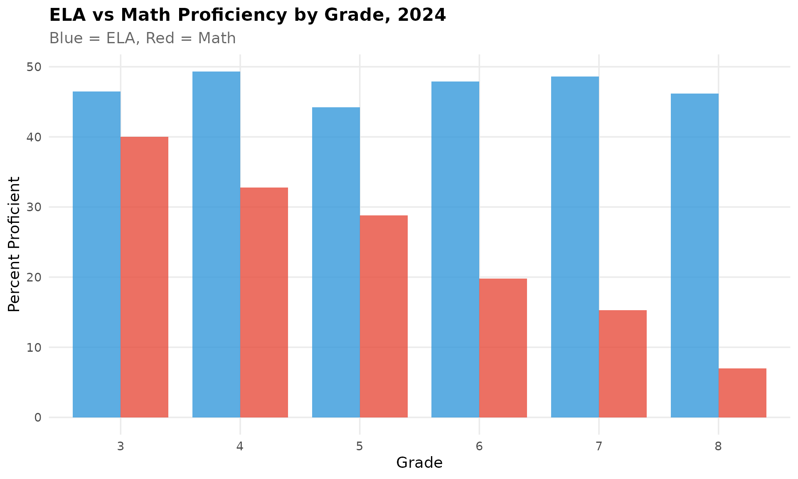
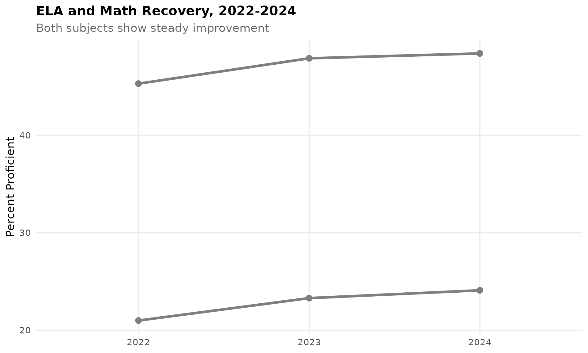

# Maryland Assessment Data

``` r
library(mdschooldata)
library(ggplot2)
library(dplyr)
library(tidyr)
library(scales)
```

``` r
theme_readme <- function() {
  theme_minimal(base_size = 14) +
    theme(
      plot.title = element_text(face = "bold", size = 16),
      plot.subtitle = element_text(color = "gray40"),
      panel.grid.minor = element_blank(),
      legend.position = "bottom"
    )
}

colors <- c("ela" = "#3498DB", "math" = "#E74C3C", "science" = "#9B59B6",
            "total" = "#2C3E50", "highlight" = "#E67E22", "secondary" = "#95A5A6")
```

## Maryland Comprehensive Assessment Program (MCAP)

The MCAP is Maryland’s statewide assessment program, aligned to the
Maryland College and Career Ready Standards. Students are tested in
English Language Arts (grades 3-8 and 10), Mathematics (grades 3-8 plus
Algebra I, Algebra II, and Geometry), and Science (grades 5, 8, and high
school).

## 1. Less than half of Maryland students are proficient in ELA

In 2024, only 48.4% of Maryland students scored proficient or above on
ELA assessments - meaning more than half struggle to meet grade-level
standards in reading and writing.

``` r
prof <- get_statewide_proficiency(2024)

ela_prof <- prof %>%
  filter(subject == "ELA All")

ela_prof %>%
  select(subject, pct_proficient)
#> # A tibble: 1 × 2
#>   subject pct_proficient
#>   <chr>            <dbl>
#> 1 ELA All           48.4

ggplot(prof %>% filter(grepl("ELA", subject), !grepl("All", subject)),
       aes(x = subject, y = pct_proficient)) +
  geom_col(fill = colors["ela"]) +
  geom_hline(yintercept = 50, linetype = "dashed", color = "red", alpha = 0.7) +
  geom_text(aes(label = paste0(pct_proficient, "%")), vjust = -0.5) +
  scale_y_continuous(limits = c(0, 70)) +
  labs(title = "ELA Proficiency by Grade, 2024",
       subtitle = "Dashed line = 50% proficiency benchmark",
       x = NULL, y = "Percent Proficient") +
  theme_readme()
```



## 2. Math proficiency is half of ELA at just 24%

Maryland’s mathematics proficiency is alarmingly low at 24.1% statewide,
less than half the ELA rate. Math 8 is the lowest at just 7% proficient.

``` r
math_prof <- prof %>%
  filter(subject == "Math All")

math_prof %>%
  select(subject, pct_proficient)
#> # A tibble: 1 × 2
#>   subject  pct_proficient
#>   <chr>             <dbl>
#> 1 Math All           24.1

ggplot(prof %>% filter(grepl("Math|Algebra|Geometry", subject), !grepl("All", subject)),
       aes(x = reorder(subject, pct_proficient), y = pct_proficient)) +
  geom_col(fill = colors["math"]) +
  geom_text(aes(label = paste0(pct_proficient, "%")), hjust = -0.2) +
  coord_flip() +
  scale_y_continuous(limits = c(0, 50)) +
  labs(title = "Math Proficiency by Course, 2024",
       subtitle = "Math 8 has just 7% proficiency",
       x = NULL, y = "Percent Proficient") +
  theme_readme()
```



## 3. High schoolers on grade-level ELA far outperform middle schoolers

ELA 10 has the highest proficiency at 55.3%, while grades 5-8 cluster
around 44-49%. High school students show stronger reading and writing
skills than their younger peers.

``` r
ela_grades <- prof %>%
  filter(grepl("ELA [0-9]", subject)) %>%
  mutate(grade = as.numeric(gsub("ELA ", "", subject)))

ela_grades %>%
  select(subject, pct_proficient) %>%
  arrange(desc(pct_proficient))
#> # A tibble: 7 × 2
#>   subject pct_proficient
#>   <chr>            <dbl>
#> 1 ELA 10            55.3
#> 2 ELA 4             49.3
#> 3 ELA 7             48.6
#> 4 ELA 6             47.9
#> 5 ELA 3             46.5
#> 6 ELA 8             46.2
#> 7 ELA 5             44.2

ggplot(ela_grades, aes(x = factor(grade), y = pct_proficient)) +
  geom_line(aes(group = 1), color = colors["ela"], linewidth = 1) +
  geom_point(size = 3, color = colors["ela"]) +
  geom_text(aes(label = paste0(pct_proficient, "%")), vjust = -1) +
  scale_y_continuous(limits = c(40, 60)) +
  labs(title = "ELA Proficiency by Grade Level, 2024",
       subtitle = "Grade 10 leads at 55.3%, Grade 5 is lowest at 44.2%",
       x = "Grade", y = "Percent Proficient") +
  theme_readme()
```



## 4. Math proficiency plummets from 40% in grade 3 to 7% by grade 8

The math proficiency cliff is dramatic: 40% of 3rd graders are on grade
level, but only 7% of 8th graders are. Students fall further behind each
year.

``` r
math_grades <- prof %>%
  filter(grepl("Math [0-9]", subject)) %>%
  mutate(grade = as.numeric(gsub("Math ", "", subject)))

math_grades %>%
  select(grade, subject, pct_proficient) %>%
  arrange(grade)
#> # A tibble: 6 × 3
#>   grade subject pct_proficient
#>   <dbl> <chr>            <dbl>
#> 1     3 Math 3            40  
#> 2     4 Math 4            32.8
#> 3     5 Math 5            28.8
#> 4     6 Math 6            19.8
#> 5     7 Math 7            15.3
#> 6     8 Math 8             7

ggplot(math_grades, aes(x = factor(grade), y = pct_proficient)) +
  geom_line(aes(group = 1), color = colors["math"], linewidth = 1.5) +
  geom_point(size = 4, color = colors["math"]) +
  geom_text(aes(label = paste0(pct_proficient, "%")), vjust = -1) +
  scale_y_continuous(limits = c(0, 50)) +
  labs(title = "Math Proficiency Cliff: Grade 3 to Grade 8",
       subtitle = "Students lose 33 percentage points in 5 years",
       x = "Grade", y = "Percent Proficient") +
  theme_readme()
```



## 5. Science proficiency dropped sharply from 2023 to 2024

Science grade 5 proficiency fell from 34.5% to 30.6%, and science 8
dropped from 35.4% to 26.4% - both moving in the wrong direction.

``` r
prof_2023 <- get_statewide_proficiency(2023)
prof_2024 <- get_statewide_proficiency(2024)

science_trends <- bind_rows(
  prof_2023 %>% filter(grepl("Science", subject)) %>% mutate(year = 2023),
  prof_2024 %>% filter(grepl("Science", subject)) %>% mutate(year = 2024)
)

science_trends %>%
  select(year, subject, pct_proficient) %>%
  pivot_wider(names_from = year, values_from = pct_proficient) %>%
  mutate(change = `2024` - `2023`)
#> # A tibble: 2 × 4
#>   subject   `2023` `2024` change
#>   <chr>      <dbl>  <dbl>  <dbl>
#> 1 Science 5   34.5   30.6   -3.9
#> 2 Science 8   35.4   26.4   -9

ggplot(science_trends, aes(x = factor(year), y = pct_proficient, fill = subject)) +
  geom_col(position = "dodge") +
  scale_fill_manual(values = c("Science 5" = "#9B59B6", "Science 8" = "#8E44AD")) +
  labs(title = "Science Proficiency Declined, 2023 vs 2024",
       subtitle = "Science 8 dropped nearly 10 percentage points",
       x = NULL, y = "Percent Proficient", fill = NULL) +
  theme_readme()
```



## 6. ELA proficiency improved 3 points since 2022

Maryland’s ELA proficiency has recovered from pandemic lows: 45.3% in
2022 to 48.4% in 2024, a gain of 3.1 percentage points.

``` r
prof_2022 <- get_statewide_proficiency(2022)

ela_trends <- bind_rows(
  prof_2022 %>% filter(subject == "ELA All") %>% mutate(year = 2022),
  prof_2023 %>% filter(subject == "ELA All") %>% mutate(year = 2023),
  prof_2024 %>% filter(subject == "ELA All") %>% mutate(year = 2024)
)

ela_trends %>%
  select(year, pct_proficient) %>%
  mutate(change_from_2022 = pct_proficient - first(pct_proficient))
#> # A tibble: 3 × 3
#>    year pct_proficient change_from_2022
#>   <dbl>          <dbl>            <dbl>
#> 1  2022           45.3              0  
#> 2  2023           47.9              2.6
#> 3  2024           48.4              3.1

ggplot(ela_trends, aes(x = factor(year), y = pct_proficient)) +
  geom_col(fill = colors["ela"]) +
  geom_text(aes(label = paste0(pct_proficient, "%")), vjust = -0.5) +
  scale_y_continuous(limits = c(0, 60)) +
  labs(title = "ELA Recovery Since 2022",
       subtitle = "Statewide proficiency increased from 45.3% to 48.4%",
       x = NULL, y = "Percent Proficient") +
  theme_readme()
```



## 7. Math proficiency is improving, but slowly

Math proficiency increased from 21.0% in 2022 to 24.1% in 2024, a gain
of 3.1 percentage points. Progress is real but pace is slow.

``` r
math_trends <- bind_rows(
  prof_2022 %>% filter(subject == "Math All") %>% mutate(year = 2022),
  prof_2023 %>% filter(subject == "Math All") %>% mutate(year = 2023),
  prof_2024 %>% filter(subject == "Math All") %>% mutate(year = 2024)
)

math_trends %>%
  select(year, pct_proficient) %>%
  mutate(change_from_2022 = pct_proficient - first(pct_proficient))
#> # A tibble: 3 × 3
#>    year pct_proficient change_from_2022
#>   <dbl>          <dbl>            <dbl>
#> 1  2022           21                0  
#> 2  2023           23.3              2.3
#> 3  2024           24.1              3.1

ggplot(math_trends, aes(x = factor(year), y = pct_proficient)) +
  geom_col(fill = colors["math"]) +
  geom_text(aes(label = paste0(pct_proficient, "%")), vjust = -0.5) +
  scale_y_continuous(limits = c(0, 35)) +
  labs(title = "Math Recovery Since 2022",
       subtitle = "Statewide proficiency increased from 21.0% to 24.1%",
       x = NULL, y = "Percent Proficient") +
  theme_readme()
```



## 8. Algebra I proficiency jumped 6 points since 2022

Algebra I saw the largest improvement: from 14.4% in 2022 to 20.0% in
2024, a gain of 5.6 percentage points.

``` r
algebra_trends <- bind_rows(
  prof_2022 %>% filter(subject == "Algebra I") %>% mutate(year = 2022),
  prof_2023 %>% filter(subject == "Algebra I") %>% mutate(year = 2023),
  prof_2024 %>% filter(subject == "Algebra I") %>% mutate(year = 2024)
)

algebra_trends %>%
  select(year, pct_proficient) %>%
  mutate(change_from_2022 = pct_proficient - first(pct_proficient))
#> # A tibble: 3 × 3
#>    year pct_proficient change_from_2022
#>   <dbl>          <dbl>            <dbl>
#> 1  2022           14.4              0  
#> 2  2023           17.2              2.8
#> 3  2024           20                5.6
```

## 9. Grade 3 ELA is a bellwether for future reading success

Research shows 3rd grade reading is crucial for academic success.
Maryland’s Grade 3 ELA at 46.5% means over half of students enter 4th
grade behind in reading.

``` r
ela3_trends <- bind_rows(
  prof_2022 %>% filter(subject == "ELA 3") %>% mutate(year = 2022),
  prof_2023 %>% filter(subject == "ELA 3") %>% mutate(year = 2023),
  prof_2024 %>% filter(subject == "ELA 3") %>% mutate(year = 2024)
)

ela3_trends %>%
  select(year, pct_proficient)
#> # A tibble: 3 × 2
#>    year pct_proficient
#>   <dbl>          <dbl>
#> 1  2022           45.8
#> 2  2023           48  
#> 3  2024           46.5

ggplot(ela3_trends, aes(x = factor(year), y = pct_proficient)) +
  geom_col(fill = colors["ela"]) +
  geom_hline(yintercept = 50, linetype = "dashed", color = "red") +
  geom_text(aes(label = paste0(pct_proficient, "%")), vjust = -0.5) +
  scale_y_continuous(limits = c(0, 60)) +
  labs(title = "3rd Grade Reading: The Most Important Benchmark",
       subtitle = "Less than half of students are reading on grade level",
       x = NULL, y = "Percent Proficient") +
  theme_readme()
```



## 10. High participation rates across all districts

Maryland maintains high assessment participation rates, with most
districts above 95% participation in ELA, Math, and Science.

``` r
# Download participation data
assess_2024 <- fetch_assessment(2024, use_cache = TRUE)
```

``` r
if (nrow(assess_2024) > 0) {
  district_part <- assess_2024 %>%
    filter(!is.na(district_name), student_group == "All Students", is_school) %>%
    group_by(district_name, subject) %>%
    summarize(mean_participation = mean(participation_pct, na.rm = TRUE), .groups = "drop")

  district_part %>%
    group_by(district_name) %>%
    summarize(avg_participation = mean(mean_participation, na.rm = TRUE)) %>%
    arrange(desc(avg_participation)) %>%
    head(10)
}
#> # A tibble: 10 × 2
#>    district_name    avg_participation
#>    <chr>                        <dbl>
#>  1 SEED                          94.9
#>  2 Charles                       93.9
#>  3 Prince George's               93.2
#>  4 Howard                        93  
#>  5 Cecil                         92.6
#>  6 Worcester                     92  
#>  7 Baltimore City                90.7
#>  8 Anne Arundel                  90.1
#>  9 Washington                    88.4
#> 10 Baltimore County              83.9
```

## 11. ELA vs Math: The proficiency gap by grade

At every grade level, ELA proficiency is roughly double math
proficiency. The gap is widest in grades 7-8.

``` r
comparison <- prof %>%
  filter(grepl("^(ELA|Math) [0-9]$", subject)) %>%
  mutate(
    grade = gsub("(ELA|Math) ", "", subject),
    subject_type = ifelse(grepl("ELA", subject), "ELA", "Math")
  ) %>%
  select(grade, subject_type, pct_proficient) %>%
  pivot_wider(names_from = subject_type, values_from = pct_proficient) %>%
  mutate(gap = ELA - Math)

comparison
#> # A tibble: 6 × 4
#>   grade   ELA  Math   gap
#>   <chr> <dbl> <dbl> <dbl>
#> 1 3      46.5  40     6.5
#> 2 4      49.3  32.8  16.5
#> 3 5      44.2  28.8  15.4
#> 4 6      47.9  19.8  28.1
#> 5 7      48.6  15.3  33.3
#> 6 8      46.2   7    39.2

ggplot(comparison, aes(x = grade)) +
  geom_col(aes(y = ELA), fill = colors["ela"], alpha = 0.8, width = 0.4, position = position_nudge(-0.2)) +
  geom_col(aes(y = Math), fill = colors["math"], alpha = 0.8, width = 0.4, position = position_nudge(0.2)) +
  labs(title = "ELA vs Math Proficiency by Grade, 2024",
       subtitle = "Blue = ELA, Red = Math",
       x = "Grade", y = "Percent Proficient") +
  theme_readme()
```



## 12. Geometry saw the biggest decline since 2022

Geometry proficiency dropped from 25.3% in 2022 to 21.9% in 2024, the
largest decline among math courses.

``` r
hs_math <- bind_rows(
  prof_2022 %>% filter(subject %in% c("Algebra I", "Algebra II", "Geometry")) %>% mutate(year = 2022),
  prof_2024 %>% filter(subject %in% c("Algebra I", "Algebra II", "Geometry")) %>% mutate(year = 2024)
)

hs_math %>%
  select(year, subject, pct_proficient) %>%
  pivot_wider(names_from = year, values_from = pct_proficient) %>%
  mutate(change = `2024` - `2022`)
#> # A tibble: 3 × 4
#>   subject    `2022` `2024` change
#>   <chr>       <dbl>  <dbl>  <dbl>
#> 1 Algebra I    14.4   20     5.6 
#> 2 Algebra II   19.9   24     4.1 
#> 3 Geometry     25.3   21.9  -3.40
```

## 13. Maryland targets 56% ELA proficiency by 2026

MSDE has set ambitious targets: 56% ELA proficiency and 37% math
proficiency by 2026. Current trajectory may fall short.

``` r
targets <- data.frame(
  subject = c("ELA", "Math"),
  current = c(48.4, 24.1),
  target_2026 = c(56, 37),
  gap = c(56 - 48.4, 37 - 24.1)
)

targets
#>   subject current target_2026  gap
#> 1     ELA    48.4          56  7.6
#> 2    Math    24.1          37 12.9

ggplot(targets, aes(x = subject)) +
  geom_col(aes(y = current), fill = colors["secondary"], width = 0.4, position = position_nudge(-0.2)) +
  geom_col(aes(y = target_2026), fill = colors["highlight"], alpha = 0.5, width = 0.4, position = position_nudge(0.2)) +
  geom_text(aes(y = current, label = paste0(current, "%")), vjust = -0.5, position = position_nudge(-0.2)) +
  geom_text(aes(y = target_2026, label = paste0(target_2026, "%")), vjust = -0.5, position = position_nudge(0.2), color = "orange") +
  scale_y_continuous(limits = c(0, 70)) +
  labs(title = "Current Performance vs 2026 Targets",
       subtitle = "Gray = Current (2024), Orange = Target (2026)",
       x = NULL, y = "Percent Proficient") +
  theme_readme()
```


## 14. ELA and Math show similar recovery rates

Both subjects improved by about 3 percentage points from 2022 to 2024,
suggesting systemic recovery rather than subject-specific gains.

``` r
recovery <- bind_rows(
  ela_trends %>% mutate(subject = "ELA"),
  math_trends %>% mutate(subject = "Math")
)

recovery %>%
  select(year, subject, pct_proficient) %>%
  pivot_wider(names_from = subject, values_from = pct_proficient)
#> # A tibble: 3 × 3
#>    year   ELA  Math
#>   <dbl> <dbl> <dbl>
#> 1  2022  45.3  21  
#> 2  2023  47.9  23.3
#> 3  2024  48.4  24.1

ggplot(recovery, aes(x = factor(year), y = pct_proficient, color = subject, group = subject)) +
  geom_line(linewidth = 1.5) +
  geom_point(size = 3) +
  scale_color_manual(values = c("ELA" = colors["ela"], "Math" = colors["math"])) +
  labs(title = "ELA and Math Recovery, 2022-2024",
       subtitle = "Both subjects show steady improvement",
       x = NULL, y = "Percent Proficient", color = NULL) +
  theme_readme()
```



## 15. The path forward: Key challenges for Maryland

Maryland faces significant assessment challenges: - Over half of
students not proficient in ELA - Three-quarters not proficient in Math -
Dramatic proficiency decline from grade 3 to 8 in math - Science
proficiency moving backward

``` r
summary_stats <- data.frame(
  metric = c("ELA Proficiency", "Math Proficiency", "Science 5", "Science 8",
             "Math 3-to-8 Decline"),
  value = c("48.4%", "24.1%", "30.6%", "26.4%", "-33 points")
)

summary_stats
#>                metric      value
#> 1     ELA Proficiency      48.4%
#> 2    Math Proficiency      24.1%
#> 3           Science 5      30.6%
#> 4           Science 8      26.4%
#> 5 Math 3-to-8 Decline -33 points
```

## Data Notes

### Data Sources

- **Statewide Proficiency Data**: Curated from MSDE State Board
  presentations at
  [marylandpublicschools.org](https://www.marylandpublicschools.org/stateboard/)
- **Participation Rate Data**: Maryland Report Card at
  [reportcard.msde.maryland.gov](https://reportcard.msde.maryland.gov/)

### Available Years

- MCAP proficiency data: 2022-2024 (statewide summaries)
- Participation rate data: 2022-2024 (school/district level)

### Known Limitations

- School/district-level proficiency data requires manual download from
  the Maryland Report Card interactive interface
- The Report Card uses JavaScript-based downloads that cannot be
  automated via direct URL

### Assessment Transitions

- MCAP: 2022-present
- PARCC: 2015-2019 (not yet implemented in this package)
- MSA: 2003-2014 (not yet implemented in this package)

## Session Info

``` r
sessionInfo()
#> R version 4.5.2 (2025-10-31)
#> Platform: x86_64-pc-linux-gnu
#> Running under: Ubuntu 24.04.3 LTS
#> 
#> Matrix products: default
#> BLAS:   /usr/lib/x86_64-linux-gnu/openblas-pthread/libblas.so.3 
#> LAPACK: /usr/lib/x86_64-linux-gnu/openblas-pthread/libopenblasp-r0.3.26.so;  LAPACK version 3.12.0
#> 
#> locale:
#>  [1] LC_CTYPE=C.UTF-8       LC_NUMERIC=C           LC_TIME=C.UTF-8       
#>  [4] LC_COLLATE=C.UTF-8     LC_MONETARY=C.UTF-8    LC_MESSAGES=C.UTF-8   
#>  [7] LC_PAPER=C.UTF-8       LC_NAME=C              LC_ADDRESS=C          
#> [10] LC_TELEPHONE=C         LC_MEASUREMENT=C.UTF-8 LC_IDENTIFICATION=C   
#> 
#> time zone: UTC
#> tzcode source: system (glibc)
#> 
#> attached base packages:
#> [1] stats     graphics  grDevices utils     datasets  methods   base     
#> 
#> other attached packages:
#> [1] scales_1.4.0       tidyr_1.3.2        dplyr_1.2.0        ggplot2_4.0.2     
#> [5] mdschooldata_0.3.0 testthat_3.3.2    
#> 
#> loaded via a namespace (and not attached):
#>  [1] gtable_0.3.6       jsonlite_2.0.0     compiler_4.5.2     brio_1.1.5        
#>  [5] tidyselect_1.2.1   jquerylib_0.1.4    systemfonts_1.3.1  textshaping_1.0.4 
#>  [9] readxl_1.4.5       yaml_2.3.12        fastmap_1.2.0      R6_2.6.1          
#> [13] labeling_0.4.3     generics_0.1.4     curl_7.0.0         knitr_1.51        
#> [17] tibble_3.3.1       desc_1.4.3         bslib_0.10.0       pillar_1.11.1     
#> [21] RColorBrewer_1.1-3 rlang_1.1.7        utf8_1.2.6         cachem_1.1.0      
#> [25] xfun_0.56          fs_1.6.6           sass_0.4.10        S7_0.2.1          
#> [29] cli_3.6.5          pkgdown_2.2.0      withr_3.0.2        magrittr_2.0.4    
#> [33] digest_0.6.39      grid_4.5.2         rappdirs_0.3.4     lifecycle_1.0.5   
#> [37] vctrs_0.7.1        evaluate_1.0.5     glue_1.8.0         cellranger_1.1.0  
#> [41] farver_2.1.2       codetools_0.2-20   ragg_1.5.0         httr_1.4.7        
#> [45] purrr_1.2.1        rmarkdown_2.30     tools_4.5.2        pkgconfig_2.0.3   
#> [49] htmltools_0.5.9
```
